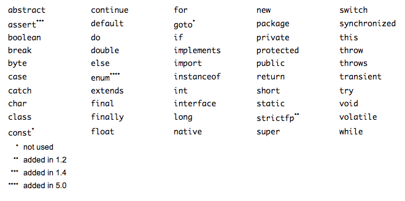
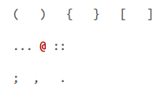

# 1. Лексическая структура

Исходный текст программ на Java состоит из совокупности пробелов, знаков окончания строки, табуляций, идентификаторов, литералов, комментариев, операторов, разделителей и ключевых слов.

Сразу стоит отметить, что Java чувствительна к регистру символов. Поэтому, к примеру, идентификаторы demo, Demo, DEMO и т.п. не являются в Java одним и тем же идентификатором, это все **РАЗНЫЕ** идентификаторы.

**Это надо усвоить сразу, раз и на всегда!**

\*\*\*\*$$a^{10} $$ ****

Условно код программы на Java можно разделить на три части:

* Незначащие символы
* Комментарии
* Лексемы

## Незначащие символы

Cимволы не служащие для генерации какого-либо кода или данных.

* пробелы
* табуляция
* ограничители строк \(LF – символ новой строки, CR – возврат каретки, CR+LF\)

## Комментарии

Служат для пояснения текста программы или генерации документации и не генерируют исполняемый код. Комментарии бывают:

* однострочные 

  ```java
  // текст комментария
  ```

* блочные 

  ```java
  /* 
  блочный
  текст 
  комментария 
  */
  ```

* комментарии документации

  ```java
  /** 
  * комментарий
  * документации
  */
  ```

## Лексемы

Лексемы – это элементарные конструкции языка, из которых транслятор javac генерирует исполняемый байт-код, который может быть выполнен виртуальной машиной Java.

_Незначащие символы_ и _комментарии_ являются разделителями для лексем, но никак не влияют на скомпилированный код.

В Java существуют следующие виды лексем:

* Идентификаторы
* Ключевые слова
* Литералы
* Разделители
* Операторы

### Идентификаторы

Идентификатором является любое символическое имя какого-либо элемента в Java-программе. Идентификатором может выступать имя класса, метода, параметра и переменной. Идентификатор должен начинаться с буквы, символа подчеркивания `_` или с валютного символа Unicode \(например, $, £, ¥\). За начальным символом может следовать любое количество букв, цифр, символов подчеркивания или валютных символов. Следует помнить, что Java использует множество символов Unicode, куда входит довольно много букв и цифр, не входящих во множество символов ASCII. Ниже представлены примеры разрешенных идентификаторов:

```java
i
engine3
theCurrentTime
the_current_time
θ
переменная
```

Идентификаторы могут содержать цифры, но не могут начинаться с цифры. Более того, идентификаторы не могут содержать знаков пунктуации, за исключением подчеркивания и валютных знаков. Обычно знак доллара и другие валютные знаки остаются в резерве для автоматического генерирования кода компилятором или другим препроцессором. Лучше избегать этих символов в создаваемых идентификаторах.

В состав идентификатора может входить любой разрешенный символ UTF-8, именно поэтому идентификаторы **переменная** и **θ** являются допустимыми идентификаторами в Java. Хотя использование не-ASCII идентификаторов является допустимым в Java, но обычно этим не пользуются и предпочитают символы латинского алфавита.

Еще одно существенное ограничение: в качестве идентификаторов нельзя применять ключевые слова и литералы \(такие как **true**, **false** и **null**\), являющиеся частью самого языка Java.

> На заметку! Начиная с версии JDK 8, сам знак подчеркивания не рекомендуется употреблять в качестве идентификатора.

### Ключевые слова

Ключевые слова языка Java сейчас насчитывают 50 слов \(рис. 1-1\), ко­торые вместе с синтасисом операторов и разделителей образуют основу языка Java. Их нельзя использовать ни в качестве идентификаторов, ни для обозначения имен переменных, классов или методов.



Кроме ключевых слов, в Java зарезервированы так же слова **true**, **false** и **null**, являющиеся литералами. Они представляют значения, определенные в специикац языка Java. Их, так же нельзя использовать для обозначения имен переменных классов и т.п.

Обратите внимание, что **const** и **goto** являются зарезервированными словами, но не представляют собой часть языка Java.

### Литералы

Литералы позволяют задать непосредственно в коде программы значения для числовых, символьных, логических и строковых выражений. В Java определены следующие типы литералов:

* **целый** \(integer\) – по умолчанию имеет тип данных _int_

```java
// примеры:
55 // десятичное
555_555 // десятичное с разделителем, для лучшего восприятия, был введен в Java 7

7000000000L // десятичное типа long, должен содержать символ L в конце, в любом регистре

07 // восьмеричное, начинается с нуля, цифры 8 и 9 запрещены,

0xFF // или
0XFF // или
0xff // шестнадцатеричное, символ X в любом регистре, шестнадцатеричные значения A, B, C, D, Е и F, так же могут записывать в любом регистре),

0b0101 // или
0B0101 // двоичное, символ B в любом регистре, введен в Java 7
```

* **вещественный** \(floating-point\) – по умолчанию имеет тип данных _double_

```java
// примеры:
5.5 //тип double

5.5f // или
5.5F // тип float, символ F в любом регистре

5. // 5.0 тип double
.24f // 0.24 тип float

0.125e4 // или
0.125E4 // тип double, символ Е в любом регистре

1600e-2 // тип double
```

* **логический** \(boolean\) 

  ```java
  // примеры:
  true
  false
  ```

* **символьный** \(charaster\) – может содержать:
  * один символ из набора Unicode, заключенный в одинарные кавычки
  * специальную последовательность \(управляющие символы\) начинающуюся со знака косой черты –  
    * **\b** – backspase BS - забой
    * **\t** – horizontal tab HT - табуляция
    * **\n** – line feed LF – конец строки
    * **\f** – form feed FF – конец страницы
    * **\r** – carriage return CR – возврат каретки
    * **\”** – двойная кавычка
    * **\’** – одинарная кавычка
    * **\\** – backslash  – обратная косая черта
    * **\uxxxx** – символ Unicode, где xxxx цифровой код символа Unicode
    * **\xxx** – символ кодовой таблицы Latin-1, где xxx восьмеричный код символа Latin-1

```java
//примеры: 
‘A’
\u0950
\b
\t
\333
// и т.п.
```

* **строковый** \(string\) – всегда имеет тип _String_ и ссылается на экземпляр класса _String_. Состоит из нуля или большего количества символов, каждый символ может быть предствлен Unicode последовательностью, так же может содержать строковый литерал.

  ```java
  // примеры:
  ""
  "string"
  "symbol \u0950"
  "test \t test"
  ```

* **null-литерал** \(null-literal\) – это литерал ссылочного типа, причем эта ссылка null ни куда не ссылается.

  ```java
  null
  ```

  Логические литералы true и false, а так же null литерал являются зарезервированными словами в Java. Их относят к литералам, поскольку с их помощью задаются значения для переменных или ссылок.

Так же тут были затронуты разные типы данных \(_int_, _long_, _double_ и _float_\), которые мы рассмотрим чуть позже, в другой главе.

### Разделители

Разделители – это специальные символы, которые используются в служебных целях языка. В Java существуют следующие 12 разделителей:



### Операторы

Операторы – используются в различных операциях: арифметических, логических, битовых, сравнения и присваивания. Ниже представлены все операторы Java:


Более подробно мы их рассмотрим чуть позже.

Ну и на последок, чтобы лексическая структура Java лучше уложилось в голове, можно запомнить простую диаграмму:


