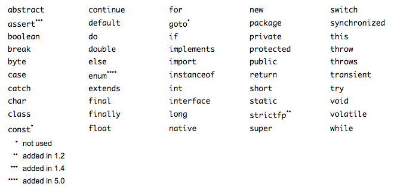
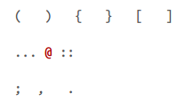

Исходный текст программ на Java состоит из совокупности пробелов, знаков окончания строки, табуляций, идентификаторов, литералов, комментариев, операторов, разделителей и ключевых слов.

Сразу стоит отметить, что Java чувствительна к регистру символов. Поэтому, к примеру, идентификаторы demo, Demo, DEMO и т.п. не являются в Java одним и тем же идентификатором, это все **РАЗНЫЕ** идентификаторы.

**Это надо усвоить сразу, раз и на всегда!**

Условно код программы на Java можно разделить на три части:
- Незначащие символы
- Комментарии
- Лексемы

## Незначащие символы
Cимволы не служащие для генерации какого-либо кода или данных.
- пробелы
- табуляция
- ограничители строк (LF – символ новой строки, CR – возврат каретки, CR+LF)

## Комментарии
Служат для пояснения текста программы или генерации документации и не генерируют исполняемый код. Комментарии бывают:
- однострочные 
```java
// текст комментария
```
- блочные 
```java
/* 
  блочный
  текст 
  комментария 
*/
```
- комментарии документации
```java
/** 
  * комментарий
  * документации
  */
```

## Лексемы 
Лексемы – это элементарные конструкции языка, из которых транслятор javac генерирует исполняемый байт-код, который может быть выполнен виртуальной машиной Java.

*Незначащие символы* и *комментарии* являются разделителями для лексем, но никак не влияют на скомпилированный код.

В Java существуют следующие виды лексем:

- Идентификаторы
- Ключевые слова
- Литералы
- Разделители
- Операторы

### Идентификаторы
Идентификатором является любое символическое имя какого-либо элемента в Java-программе. Идентификатором может выступать имя класса, метода, параметра и переменной. Идентификатор должен начинаться с буквы, символа подчеркивания ```_``` или с валютного символа Unicode (например, $, £, ¥). За начальным символом может следовать любое количество букв, цифр, символов подчеркивания или валютных символов. Следует помнить, что Java использует множество символов Unicode, куда входит довольно много букв и цифр, не входящих во множество символов ASCII. Ниже представлены примеры разрешенных идентификаторов:
```java
i
engine3
theCurrentTime
the_current_time
θ
переменная
```
Идентификаторы могут содержать цифры, но не могут начинаться с цифры. Более того, идентификаторы не могут содержать знаков пунктуации, за исключением подчеркивания и валютных знаков. Обычно знак доллара и другие валютные знаки остаются в резерве для автоматического генерирования кода компилятором или другим препроцессором. Лучше избегать этих символов в создаваемых идентификаторах.

В состав идентификатора может входить любой разрешенный символ UTF-8, именно поэтому идентификаторы **переменная** и **θ** являются допустимыми идентификаторами в Java. Хотя использование не-ASCII идентификаторов является допустимым в Java, но обычно этим не пользуются и предпочитают символы латинского алфавита.

Еще одно существенное ограничение: в качестве идентификаторов нельзя применять ключевые слова и литералы (такие как **true**, **false** и **null**), являющиеся частью самого языка Java.

> На заметку! Начиная с версии JDK 8, сам знак подчеркивания не рекомендуется употреблять в качестве идентификатора.

### Ключевые слова
Ключевые слова языка Java сейчас насчитывают 50 слов (рис. 1-1), ко­торые вместе с синтасисом операторов и разделителей образуют основу языка Java. Их нельзя использовать ни в качестве идентификаторов, ни для обозначения имен переменных, классов или методов.



Кроме ключевых слов, в Java зарезервированы так же слова **true**, **false** и **null**, являющиеся литералами. Они представляют значения, определенные в специикац языка Java. Их, так же нельзя использовать для обозначения имен переменных классов и т.п.

Обратите внимание, что **const** и **goto** являются зарезервированными словами, но не представляют собой часть языка Java.

### Литералы
Литералы позволяют задать непосредственно в коде программы значения для числовых, символьных, логических и строковых выражений. В Java определены следующие типы литералов:
- **целый** (integer) – по умолчанию имеет тип данных *int*

```java
// примеры:
55 // десятичное
555_555 // десятичное с разделителем, для лучшего восприятия, был введен в Java 7

7000000000L // десятичное типа long, должен содержать символ L в конце, в любом регистре

07 // восьмеричное, начинается с нуля, цифры 8 и 9 запрещены,

0xFF // или
0XFF // или
0xff // шестнадцатеричное, символ X в любом регистре, шестнадцатеричные значения A, B, C, D, Е и F, так же могут записывать в любом регистре),

0b0101 // или
0B0101 // двоичное, символ B в любом регистре, введен в Java 7
```

- **вещественный** (floating-point) – по умолчанию имеет тип данных *double*

```java
// примеры:
5.5 //тип double

5.5f // или
5.5F // тип float, символ F в любом регистре

5. // 5.0 тип double
.24f // 0.24 тип float

0.125e4 // или
0.125E4 // тип double, символ Е в любом регистре

1600e-2 // тип double
```

- **логический** (boolean) 
```java
// примеры:
true
false
```
- **символьный** (charaster) – может содержать:
  - один символ из набора Unicode, заключенный в одинарные кавычки
  - специальную последовательность (управляющие символы) начинающуюся со знака косой черты – \ 
    - **\b** – backspase BS - забой
    - **\t** – horizontal tab HT - табуляция
    - **\n** – line feed LF – конец строки
    - **\f** – form feed FF – конец страницы
    - **\r** – carriage return CR – возврат каретки
    - **\”** – двойная кавычка
    - **\’** – одинарная кавычка
    - **\\\\** – backslash \ – обратная косая черта
    - **\uxxxx** – символ Unicode, где xxxx цифровой код символа Unicode
    - **\xxx** – символ кодовой таблицы Latin-1, где xxx восьмеричный код символа Latin-1
    
```java
//примеры: 
‘A’
\u0950
\b
\t
\333
// и т.п.
```
- **строковый** (string) – всегда имеет тип *String* и ссылается на экземпляр класса *String*. Состоит из нуля или большего количества символов, каждый символ может быть предствлен Unicode последовательностью, так же может содержать строковый литерал.
```java
// примеры:
""
"string"
"symbol \u0950"
"test \t test"
```
- **null-литерал** (null-literal) – это литерал ссылочного типа, причем эта ссылка null ни куда не ссылается.
```java
null
```
Логические литералы true и false, а так же null литерал являются зарезервированными словами в Java. Их относят к литералам, поскольку с их помощью задаются значения для переменных или ссылок.

Так же тут были затронуты разные типы данных (*int*, *long*, *double* и *float*), которые мы рассмотрим чуть позже, в другой главе.

### Разделители
Разделители – это специальные символы, которые используются в служебных целях языка. В Java существуют следующие 12 разделителей:



### Операторы
Операторы – используются в различных операциях: арифметических, логических, битовых, сравнения и присваивания. Ниже представлены все операторы Java:


Более подробно мы их рассмотрим чуть позже.

Ну и на последок, чтобы лексическая структура Java лучше уложилось в голове, можно запомнить простую диаграмму:


<iframe height="400px" width="100%" src="https://repl.it/@haschish/ttt?lite=true" scrolling="no" frameborder="no" allowtransparency="true" allowfullscreen="true" sandbox="allow-forms allow-pointer-lock allow-popups allow-same-origin allow-scripts allow-modals"></iframe>
