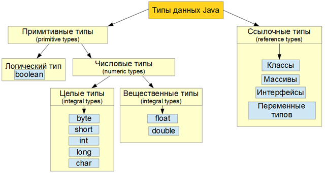

# 3. Типы данных

Прежде всего, важно уяснить, что **Java — строго типизированный язык**. Действительно, в определенной степени безопасность и надежность Java-программ обусловлена именно этим обстоятельством. Давайте разберемся, что это означает.

Во-первых, каждая переменная обладает типом, каждое выражение имеет тип, и каждый тип строго определен. Во-вторых, все присваивания, как явные, так и посредством передачи параметров в вызовах методов, проверяются на соответствие типов. Компилятор Java проверяет все выражения и параметры на предмет совместимости типов. Любые несоответствия типов являются ошибками, которые должны быть исправлены до завершения компиляции класса.

Типы данных в языке Java, делятся на две группы: примитивные типы \(_primitive types_\) и ссылочные типы \(_reference types_\).

Существует так же специальный тип данных – _null_. Переменную этого типа создать невозможно, но можно присвоить значение _null_ любому ссылочному типу данных.

## Примитивные типы данных Java

Существует восемь примитивных типов данных в Java:

* Числовые данные \(_numeric types_\)
* Целые типы \(_integral types_\) – _byte_, _short_, _int_, _long_, _char_
* Вещественные типы \(_floating-point types_\) – _float_, _double_
* Логический тип – _boolean_

  **Переменные примитивных типов хранят значение**.

## Ссылочные типы данных Java

Существует четыре типа ссылочных данных в Java:

* Классы \(_class types_\)
* Интерфейсы \(_interface types_\)
* Переменные типов \(_type variables_\)
* Массивы \(_array types_\)

  **Переменные ссылочных типов хранят ссылку на объект**, или же тип данных null, то есть нулевую \(пустую\) ссылку.

Cуществует очень много программистских мифов и фольклорных данных, которые по разному классифицируют принадлежность всех вышеперечисленных типов. Иногда, к примеру, тип _char_ выделают в отельный тип, так как он представляет символы, но как вы можете убедится сами из оригинальной документации по Java – это не так. _Char_ \(символьный тип\), в оригинальной документации, относят к целым типам данных, потому что над ним можно выполнять все те же операции, что и над обычными числовыми типами. Так же, почему то, очень часто пропускают типизированные переменные и в ссылочных типах указывать только три оставшихся. Или выделяют _enum_ в отдельный тип ссылочных данных, хотя он относится к классам, так же поступают иногда и с классом _String_ – выделяют его в отельный вид ссылочных данных, хотя это класс. Все это тайна покрытая мраком, но свет изначальной [документации](https://docs.oracle.com/en/java/) выведет нас к истине!

На этом лирическое отступление закончим и зафиксируем знания о типах данных Java запомнив простую диаграмму приведенную ниже.

