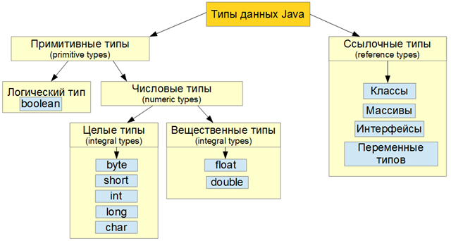

Прежде всего, важно уяснить, что Java — строго типизированный язык. Действительно, в определенной степени безопасность и надежность Java-программ обусловлена именно этим обстоятельством. Давайте разберемся, что это означает. 

Во-первых, каждая переменная обладает типом, каждое выражение имеет тип, и каждый тип строго определен. Во-вторых, все присваивания, как явные, так и посредством передачи параметров в вызовах методов, проверяются на соответствие типов. Компилятор Java проверяет все выражения и параметры на предмет совместимости типов. Любые несоответствия типов являются ошибками, которые должны быть исправлены до завершения компиляции класса.

Типы данных в языке Java, делятся на две группы: примитивные типы (*primitive types*) и ссылочные типы (*reference types*).

Существует так же специальный тип данных – *null*. Переменную этого типа создать невозможно, но можно присвоить значение *null* любому ссылочному типу данных.

## Примитивные типы данных Java
Существует восемь примитивных типов данных в Java:
- Числовые данные (*numeric types*)
- Целые типы (*integral types*) – *byte*, *short*, *int*, *long*, *char*
- Вещественные типы (*floating-point types*) – *float*, *double*
- Логический тип – *boolean*
Переменные примитивных типов хранят значение.

## Ссылочные типы данных Java
Существует четыре типа ссылочных данных в Java:
- Классы (*class types*)
- Интерфейсы (*interface types*)
- Переменные типов (*type variables*)
- Массивы (*array types*)
Переменные ссылочных типов хранят ссылку на объект, или же тип данных null, то есть нулевую (пустую) ссылку.

Cуществует очень много программистских мифов и фольклорных данных, которые по разному классифицируют принадлежность всех вышеперечисленных типов. Иногда, к примеру, тип *char* выделают в отельный тип, так как он представляет символы, но как вы можете убедится сами из оригинальной документации по Java – это не так. *Char* (символьный тип), в оригинальной документации, относят к целым типам данных, потому что над ним можно выполнять все те же операции, что и над обычными числовыми типами. Так же, почему то, очень часто пропускают типизированные переменные и в ссылочных типах указывать только три оставшихся. Или выделяют *enum* в отдельный тип ссылочных данных, хотя он относится к классам, так же поступают иногда и с классом *String* – выделяют его в отельный вид ссылочных данных, хотя это класс. Все это тайна покрытая мраком, но свет изначальной [документации](https://docs.oracle.com/en/java/) выведет нас к истине!

На этом лирическое отступление закончим и зафиксируем знания о типах данных Java запомнив простую диаграмму приведенную ниже.

