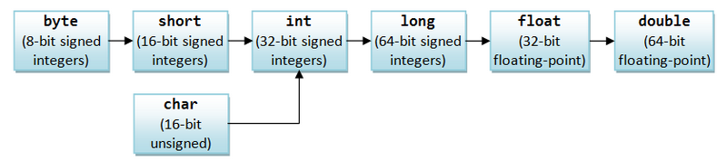
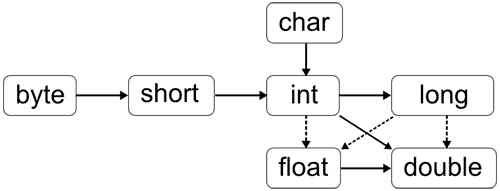

# 3.6 Преобразование примитивных типов

[Преобразование типов в Java](https://docs.oracle.com/javase/specs/jls/se15/html/jls-5.html) это достаточно большая тема, но мы постараемся рассмотреть ее компактно и вместе с тем как можно более полно. Частично мы уже касались этой темы.

В Java возможны преобразования между целыми значениями и значениями с плавающей точкой. Кроме того, можно преобразовывать значения целых типов и типов с плавающей точкой в значения типа char и наоборот, поскольку каждый символ соответствует цифре в кодировке Unicode. Фактически тип _boolean_ является единственным примитивным типом в Java, который нельзя преобразовать в другой примитивный тип. Кроме того, любой другой примитивный тип нельзя преобразовать в _boolean_.

Преобразование типов в Java бывает двух видов: неявное и явное.

## Неявное преобразование

Неявное преобразование типов выполняется в случае если выполняются условия:

* Оба типа совместимы
* Длина целевого типа больше или равна длине исходного типа



Во всех остальных случаях должно использоваться **явное преобразование типов**.

Так же существуют два типа преобразований:

* Расширяющее преобразование \(widening conversion\)
* Сужающее преобразование \(narrowing conversion\)

Расширяющее преобразование происходит, если значение одного типа преобразовывается в более широкий тип, с большим диапазоном допустимых значений. Java выполняет расширяющие преобразования автоматически, например, если вы присвоили литерал типа _int_ переменной типа _double_ или значение пепременной типа _char_ переменной типа _int_. Неявное преобразование всегда имеет расширяющий тип.

Но и тут могут быть свои небольшие грабельки. Например, если преобразуется значение _int_ в значение типа _float_. И у значения _int_ в двоичном представлении больше чем 23 значащих бита, то возможна потеря точности, так как у типа _float_ под целую часть отведено 23 бита. Все младшие биты значения _int_, которые не поместятся в 23 бита мантиссы _float_, будут отброшены, поэтому, хотя порядок числа сохранится, но точность будет утеряна. То же самое справедливо для преобразования типа _long_ в тип _double_.

Расширяющее преобразование типов Java можно изобразить еще так:



Сплошные линии обозначают преобразования, выполняемые без потери данных. Штриховые линии говорят о том, что при преобразовании может произойти потеря точности.

Стоит так же скажать, что тип _byte_ не преобразуется автоматически \(не явно\) в тип _char_, хотя тип _byte_ имеет ширину 8 бит, а _char_ 16. Тоже самое касается и преобразования типа _short_ в _char_.  
Это происходит потому, что _byte_ и _short_ знаковые типы данных, а _char_ беззнаковый. Поэтому в данном случае требуется использовать явное приведение типов, поскольку компилятору надо явно указать что вы знаете чего хотите и как будет обрабатываться знаковый бит типов _byte_ и _short_ при преобразовании к типу _char_.

Сужающее преобразование происходит, если значение преобразуется в значение типа, диапазон которого не шире изначального. Сужающие преобразования не всегда безопасны: например, преобразование целого значения 13 в _byte_ имеет смысл, а преобразование 13000 в _byte_ неразумно, ведь _byte_ может хранить только числа от −128 до 127.  
Поскольку во время сужающего преобразования могут быть потеряны данные, Java компилятор возражает против любого такого преобразования, даже если преобразуемое значение укладывается в более узкий диапазон указанного типа:

```java
int i = 13;
byte b = i; // Компилятор не разрешит это выражение
```

Единственное исключение из правила – присвоение целого литерала \(значения типа int\) переменной byte или short, если литерал соответствует диапазону переменной.

```java
byte b = 13; // Компилятор разрешает, значение соотвествует диапазону

byte b1 = 1000; // Компилятор не разрешает
```

Сужающее преобразование это всегда явное преобразование типов.

## Явное преобразование

Оператором явного преобразования типов или точнее говоря приведения типов являются круглые скобки, внутри которых указан тип, к которому происходит преобразование:

```java
int i = 13;
byte b = (byte) i; // Принудительное преобразование int в byte
i = (int) 13.456; // Принудительное преобразование литерала типа double в int
```

Приведение примитивных типов чаще всего используют для преобразования значений с плавающей точкой в целые числа. При этом дробная часть значения с плавающей точкой просто отбрасывается, то есть значение с плавающей точкой округляется по направлению к нулю, а не к ближайшему целому числу. Берется только целочисленная часть вещественного типа и она уже приводится к целевому типу целочисленного числа.

При приведении более емкого целого типа к менее емкому старшие биты просто отбрасываются.

## Автоматическое расширение типов в выражениях

Так же стоит еще раз упомянуть об автоматическом повышении \(расширении\) типов в выражениях. Мы с этим уже сталкивались когда рассматривали целочисленные типы данных и операции над ними, но все же стоит и тут напомнить, чтобы усвоилось еще лучше и к тому же это имеет непосредственное отношение к данной теме. Знак `@` означает любой допустимый оператор, например +, –, \*, / и т.п.

При вычислении выражения \(a @ b\) аргументы a и b преобразовываются в числа имеющие одинаковый тип:

* если одно из чисел _double_, то в _double_;
* иначе, если одно из чисел _float_, то в _float_;
* иначе, если одно из чисел _long_, то в _long_;
* иначе оба числа преобразуются в _int_.

  ```java
  byte b = 1;
  byte c = b + 1; // Ошибка компиляции
  ```

  То есть, все целочисленные литералы в выражениях, а так же типы _byte_, _short_ и _char_ расширяются до _int_. Если, как описано выше, в выражении не присутствуют другие, более большие типы данных \(_long_, _float_ или _double_\). Поэтому приведенный выше пример вызовет ошибку компиляции, так как переменная **c** имеет тип _byte_, а выражение `b + 1`, в результате автоматического повышения имеет тип _int_.

