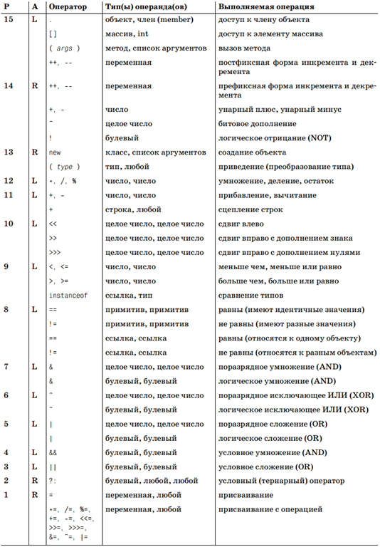

Достаточно большую часть операторов Java мы уже рассмотрели вместе с примитивными типами, но есть некоторые вещи которые мы еще не разбирали или касались лишь слегка. Теперь постараемся устранить эти пробелы.

У операторов Java есть приоритет выполнения, а так же понятие ассоциативности связанное с приоритетом.

В таблице ниже приведены доступные в Java операторы. Колонки P и А определяют приоритет и ассоциативность для каждой группы родственных операторов соответственно.



## Приоритет

В колонке P таблицы определен приоритет (precedence) для каждого оператора. Приоритет определяет порядок выполнения операторов. Рассмотрим следующее выражение:
```java
a + b * c
```
Оператор умножения имеет более высокий приоритет, чем оператор сложения, поэтому ```a``` прибавляется к произведению ```b``` и ```c```. Приоритет операторов можно считать показателем степени связанности операторов с их операндами. Чем больше число, тем сильнее они связаны.

Приоритет операторов по умолчанию можно изменить с помощью круглых скобок, которые явно укажут порядок операций. Чтобы сложение выполнялось перед умножением, предыдущее выражение можно переписать таким образом:
```java
(a + b) * c
```
В Java приоритет операторов был выбран с намерением обеспечить совместимость с С; разработчики языка С выбрали такой приоритет, чтобы писать большую часть выражений естественно, без круглых скобок. В Java существует несколько общеупотребительных идиом, требующих наличия круглых скобок. Среди них:

- Приведение класса, объединенное с доступом к члену
  ```java
  (( Integer) o).intValue();
  ```
- Присваивание в совокупности со сравнением
  ```java
  while(( line = in.readLine()) != null) { ... }
  ```
- Побитовые операторы в совокупности со сравнением
  ```java
  if (( flags & (PUBLIC | PROTECTED)) != 0) { ... }
  ```
Может пока это и не понятно, что и для чего, но просто мотаем на ус или завязываем узелок на память.

## Ассоциативность
Если выражение включает несколько операторов с одинаковым приоритетом, то порядком выполнения операций управляет ассоциативность операторов. Большинство операторов ассоциативны слева направо, то есть операции выполняются слева направо. Однако операторы присваивания и унарные операторы обратно ассоциативны (справа налево). В колонке А таблицы приоритетов операторов определена ассоциативность для каждого оператора или группы операторов. Значение L означает ассоциативность слева направо, а R означает обратную ассоциативность.

Аддитивные операторы ассоциативны слева направо, то есть выражение ```a + b - c``` вычисляется слева направо: ```(a + b) - c```. Унарные операторы и операторы присваивания вычисляются справа налево. Рассмотрим более сложное выражение:
```java
a = b += c = ~d
```
Оно вычисляется следующим образом:
```java
a = ( b += ( c = (~d)))
```
Так же как и приоритет операторов, ассоциативность устанавливает порядок вычисления выражений по умолчанию. Порядок по умолчанию можно изменить при помощи круглых скобок. Впрочем, в Java ассоциативность операторов по умолчанию предоставляет естественный синтаксис выражений. Очень редко возникает необходимость изменять его.

## Количество и типы операндов
В четвертой колонке таблицы приоритетов операторов определены возможные типы и количество операндов для каждого оператора. Некоторые операторы работают только с одним операндом; они называются унарными операторами. Например, оператор «унарный минус» меняет знак отдельного числа.
```java
-n // Оператор «унарный минус»
```
Однако большинство операторов являются бинарными; они работают с двумя операндами. Оператор (минус) может выступать в обеих формах:
```java
a - b // Оператор вычитания является бинарным
```
В Java также определен один тернарный (ternary) оператор (работает с тремя операндами), часто называемый условным оператором. Он похож на условный оператор *if*, но стоит внутри выражения. Эти три операнда разделяются знаком вопроса и двоеточием; второй и третий операнды должны относиться к одному типу.
```java
x > y ? x : y // Это тернарное выражение, возвращает большее число из x и y.
```
Тернарный оператор мы рассмотрим поподробнее чуть позже.

Кроме определенного количества операндов, каждый оператор ожидает конкретные типы операндов. В четвертой колонке таблицы перечислены типы операндов. Некоторые коды из этой колонки необходимо объяснить подробнее:

- **число** - Целое число, значение с плавающей точкой или символ (то есть любой примитивный тип, кроме *boolean*).
- **целое число** - Значения: *byte*, *short*, *int*, *long* или *char* (значения *long* не допускаются в операторе доступа к массиву []).
- **ссылка** - Объект или массив.
- **переменная** - Переменная или любая другая величина (например, элемент массива), которой можно присвоить значение.

## Возвращаемый тип
Подобно тому как каждый оператор ожидает операнды определенных типов, любой оператор выдает значение определенного типа. И тут действует правило приведения типов, которое мы уже обсуждали.

Операторы сравнения, равенства и булевые операторы всегда возвращают булевые значения. Все операторы присваивания возвращают присваиваемое значение, тип которого должен быть совместим с переменной, находящейся в левой части выражения. Тернарный оператор возвращает значение второго или третьего аргумента, которые должны относиться к одному типу.

## Побочные эффекты
Каждый оператор вычисляет значение на основе одного или нескольких операндов. Однако некоторые операторы, в дополнение к основному вычислению, приводят к побочным эффектам.

Если выражение подразумевает побочные эффекты, то при его вычислении состояние Java программы изменяется настолько, что повторное вычисление выражения может привести к результату, отличному от первого. Например, оператор инкремента ```++``` имеет побочный эффект приращения переменной.  
Выражение ```++a;``` увеличивает значение переменной a и возвращает новое, увеличенное значение. При следующем вычислении этого выражения получится уже другое значение. 

Различные операторы присваивания также имеют побочные эффекты. Например, выражение ```a *= 2``` можно записать в виде ```a = a * 2```. Значением выражения является значение **a**, умноженное на 2, но выражение имеет побочный эффект сохранения нового значения в **a**. 

Оператор вызова метода **()**  имеет побочные эффекты, если побочные эффекты есть у вызываемого метода. Некоторые методы, например ```Math.sqrt()```, просто вычисляют и возвращают значение без каких-либо побочных эффектов. Однако обычно методы все-таки имеют побочные эффекты. 

И наконец, оператор **new** имеет существенный побочный эффект, выраженный в создании нового объекта.

## Порядок вычислений
Вычисляя выражение, интерпретатор Java выполняет различные операции в последовательности, заданной круглыми скобоками, а также приоритетом и ассоциативностью операторов. Однако перед началом операции интерпретатор вычисляет операнды оператора (исключение составляют операторы **&&**, **||**  и **?:**, которые не всегда вычисляют все свои операнды). Интерпретатор всегда вычисляет операнды слева направо. Это имеет значение, если какой-либо из операндов является выражением с побочными эффектами. В качестве примера рассмотрим следующий код:
```java
int a = 2;
int v = ++a + ++a * ++a;
```
Хотя умножение выполняется перед сложением, первыми вычисляются операнды оператора **++**. Таким образом, выражение будет равно ```3 + 4 * 5```, или 23.

Хотя большинство операторов мы уже рассмотрели совместно с примитивными типами данных, но там был акцент именно на примитивных типах данных и операторы мы использовали чтобы понять что это за типы. Теперь же рассмотрим операторы чуть подробнее, так как там тоже могут быть грабельки.

## Арифметические операторы
Поскольку большинство программ работает, в первую очередь, с числами, наиболее часто используются операторы, выполняющие арифметические операции. Арифметические операторы можно задавать с целыми числами, числами с плавающей точкой и даже с символами (то есть их можно применять с любым примитивным типом данных, кроме *boolean*).  
Арифметические операции с плавающей точкой применяются, если один из операндов является числом с плавающей точкой; в противном случае задействуется целочисленная арифметика. Это важно, так как арифметика для чисел с плавающей точкой отличается от целочисленной арифметики – например, по способу деления и способу обработки переполнения и округления. Существуют следующие арифметические операторы:

### Сложение « + »
Оператор **+** складывает два числа. Как вы уже возможно замечали, оператор **+** можно применять для сцепления строк. Если один из операндов сложения является строкой, то другой операнд также преобразуется в строку. Если вы хотите сочетать сложение со сцеплением, убедитесь в наличии круглых скобок. Например:
```java
System.out.println("Total: " + 3 + 4); // выведет "Total: 34", а не "Total: 7"
```

### Вычитание « − »
Если оператор является бинарным, то он вычитает второй операнд из первого. Например, ```7 − 3``` равняется 4. Оператор « **−** » может выполнять унарную инверсию.

### Умножение « * »
Оператор * умножает два числа. Например, ```7 * 3``` равняется 21.

### Деление « / »

Оператор / делит первый операнд на второй. Деление целого числа на целое число дает целое число, а возможный остаток теряется. Однако если один из операндов является числом с плавающей точкой, то в результате деления получается число с плавающей точкой. Для целых чисел деление на нуль генерирует исключение ArithmeticException. В то же время при вычислениях, вовлекающих числа с плавающей точкой, деление на нуль просто дает бесконечность либо NaN:
```java
7 / 3      // Равно 2
7 / 3.0f   // Равно 2.333333f
7 / 0      // Генерируется ArithmeticException
7 / 0.0    // Равно плюс бесконечности
0.0 / 0.0  // Равно NaN
```

### Деление по модулю « / »
Мы его уже подробно рассматривали, но для порядку еще разок, то что было пропущено.

Оператор **%** вычисляет первый операнд по модулю второго (то есть он возвращает целый остаток от деления первого операнда на второй). Например, ```7 % 3``` дает 1.  
Знак результата совпадает со знаком первого операнда. Хотя оператор взятия по модулю обычно используют с целыми числами, он также подходит для значений с плавающей точкой. Например, ```4.3 % 2.1``` равняется 0.1. 

Вычисление значений по модулю нуль для целых чисел приводит к *ArithmeticException*. Для значений с плавающей точкой любое значение по модулю 0.0 и бесконечность по любому модулю дают *NaN*.

### Унарный минус « − »
Если « **−** » используется как унарный оператор перед отдельным операндом, он выполняет унарную инверсию знака. Другими словами, он переводит положительное значение в эквивалентное ему отрицательное, и наоборот.

## Оператор сцепления строк
Кроме сложения чисел, оператор **+** и родственный оператор **+=** могут сцеплять, или соединять, строки. Если один из складываемых операндов является строкой, оператор преобразовывает другой операнд в строку. Например:
```java
System.out.println("Quotient: " + 7/3.0f); // Отображает "Quotient: 2.3333333"
```
Не забывайте заключать операции сложения в круглые скобки, если сочетаете их со сцеплением строк. В противном случае оператор сложения будет интерпретирован как оператор сцепления.

В интерпретатор Java встроены строковые преобразования для всех примитивных типов данных. Объект можно преобразовать в строку посредством метода *toString()*. В некоторых классах определены специальные методы *toString()*, чтобы с их помощью легко преобразовывать объекты данного класса в строки. Массив преобразуется в строку при вызове встроенного метода *toString()* , который, к сожалению, не возвращает удобное строковое представление содержимого массива.

## Операторы инкремента и декремента
Оператор **++** увеличивает на единицу операнд, который является переменной, элементом массива или полем объекта. Поведение данного оператора зависит от его положения относительно операнда. Если оператор находится перед операндом, то он называется оператором префиксной формы инкремента (preincrement). Он увеличивает значение операнда на единицу и возвращает вычисленное значение. Если же оператор находится после операнда, то он называется оператором постфиксной формы инкремента (postincrement). Такой оператор увеличивает значение операнда на единицу, но возвращает значение операнда до увеличения.

Например, в следующем коде обе величины i и j получают значение 2:
```java
i = 1;
j = ++i;
```
Однако в следующем примере i получает значение 2, a j  – значение 1:
```java
i = 1;
j = i++;
```

Аналогично, оператор **--** уменьшает на единицу числовой операнд, который является переменной, элементом массива или полем объекта. Как и в случае оператора **++**, поведение оператора **--** зависит от его положения относительно операнда. Находясь перед операндом, он уменьшает значение операнда на единицу и возвращает полученное значение. Находясь после операнда, он уменьшает значение операнда на единицу, но возвращает первоначальное значение.

Выражения ```x++``` и ```x--``` эквивалентны выражениям ```x = x + 1``` и ```x = x - 1```  соответственно; x вычисляется один раз, за исключением случаев использования операторов инкремента и декремента. Если x является выражением с побочными эффектами, это существенно меняет дело. Например, следующие два выражения не идентичны:
```java
a[i++]++;  // Увеличивает элемент массива
a[i++] = a[i++] + 1; // Прибавляет единицу к одному элементу массива, а сохраняет его в другом
```
Чаще всего эти операторы – как в префиксной, так и в постфиксной форме – применяются для увеличения и уменьшения значения счетчика цикла.

## Операторы присваивания
Операторы присваивания сохраняют, или присваивают, значение какой-либо переменной. Левый операнд должен быть локальной переменной, элементом массива или полем объекта. Справа может находиться любое значение типа, совместимого с переменной. В отличие от всех остальных операторов, операторы присваивания обратно ассоциативны, то есть присваивания в ```a = b = c``` выполняются справа налево: ```a = (b = c)```.

## Условный оператор
Условный оператор **?:**  является тернарным оператором (три операнда), унаследованным из языка С. Он позволяет внедрять условие в само выражение. Его можно представить как версию оператора *if/else*. 

Знак вопроса (?) разделяет первый и второй операнды условного оператора, а двоеточие (:) – второй и третий. Первый операнд должен иметь boolean значение. Второй и третий операнды могут быть любого типа, но они должны приводиться к одному и тому же типу. 

Вначале условный оператор вычисляет первый операнд. Если он истинен, оператор вычисляет второй операнд, а результат представляет как значение выражения. В противном случае, если первый операнд ложен, условный оператор вычисляет и возвращает третий операнд. Условный оператор никогда не вычисляет оба операнда (второй и третий), поэтому следует осторожно использовать выражения с побочными эффектами. Ниже приведены примеры оператора:
```java
int max = (x > y) ? x : y;
String name = (name != null) ? name : "unknown";
```
>>> Приоритет оператора **?**  ниже, чем всех других операторов, кроме операторов присваивания. Таким образом, операнды этого оператора обычно не нужно заключать в круглые скобки. Однако большинству программистов легче читать условные выражения, когда первый операнд заключен в круглые скобки – особенно если учесть, что и в условном операторе if условное выражение всегда заключено в круглые скобки.

## Преобразование или приведение типа « () »
Как вы уже могли убедиться, круглые скобки можно применять как оператор сужающего преобразования, или приведения типа. Первым операндом этого оператора является тип, к которому выполняется приведение; он заключается в скобки. Второй операнд представляет собой преобразуемое значение; он следует после скобок. Например:
```java
(byte) 28 // Целый литерал приводится к типу byte
(int) (x + 3.14f) // Значение суммы с плавающей точкой приводится к целому
(String) h.get(k) // Базовый объект приводится к более узкому типу
```

Подводя итог данной теме надо сказать, что с какими-то операторами мы уже сталкивались и работали, с какими-то еще нет, но обязательно их изучим. В данном случае это просто информация к запоминанию и чтобы было какое-то систематизированное представление об операторах языка Java.
