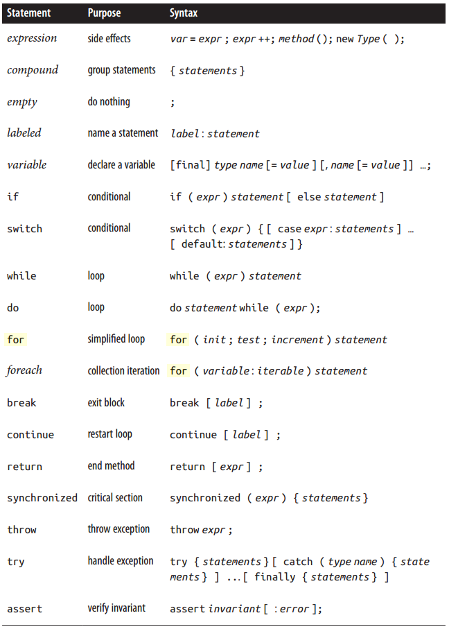
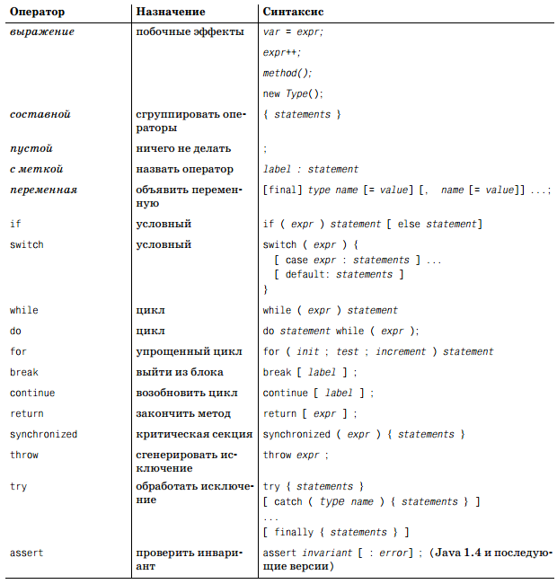

В английском языке для обозначения обычных операторов, которые мы уже рассматривали, и инструкций существуют два различных термина: *operator* и *statement* соответственно. Однако в русском языке оба этих термина переводятся как «оператор».

Чаще всего операторы-инструкции, в руководствах и книгах, называют управляющими операторами или управляющими конструкциями Java и имеют в виду под ними операторы циклов, условные операторы и т.п. В большинстве случаев это так и есть, но оригинальная документация Oracle к операторам инструкциям (statement) относит так же и другие операторы, например – выражения и составные операторы.

И так, трудности перевода прояснены и далее для краткости будем использовать термин «оператор» как для операторов, так и для операторов-инструкций.

И теперь тоже самое на русском

В русской таблице отсутствует описание оператора foreach, но в английской оно есть. Это разновидность цикла for, что даже видно из таблицы на английском и было введено в Java 5. Применим к массивам и классам, реализующим интерфейс java.lang.Iterable.
