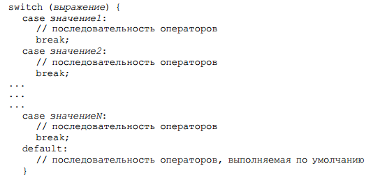

# 6.3 switch

Оператор switch состоит из выражения и тела, которое содержит различные пронумерованные точки входа. Выражение вычисляется, и управление переходит на точку входа, определенную полученным значением. Выражение должно возвращать следующие тип данных: _int_, _short_, _char_, _byte_ \(или их обертки\), _String_ или _enum_.

Общая форма оператора switch имеет следующий вид:



Часто он оказывается эффективнее применения длинных последовательностей операторов if-else-if. Например, последний код из темы _\*if/else_ можно переписать таким образом:

```java
switch(n) {
  case 1: {
    // Выполнить блок кода №1
    break;
  }
  case 2: {
    // Выполнить блок кода №2
    break;
  }
  case 3: {
    // Выполнить блок кода №3
    break;
  }
  default: {
    // Если ни одно условие не выполнилось, выполнить блок №4
  }
}
```

При выполнении оператора switch интерпретатор вычисляет значение выражения в круглых скобках, а затем ищет метку case, соответствующую полученному значению. Если интерпретатор находит метку, он начинает выполнять блок программы с первого оператора после метки case. Если интерпретатор не находит метку case с соответствующим значением, он начинает выполнение блока с первого оператора после специальной метки default:. Или ничего не выполняет, раз не нашлось подходящей метки.

Обратите внимание на использование ключевого слова _break_ в конце каждого _case_ в предыдущем примере. Оператор _break_ будет описан чуть позже; в данном случае он заставляет интерпретатор покинуть оператор _switch_. Метки _case_ определяют только начальную точку нужного кода. Отдельные варианты не являются независимыми блоками программы и не содержат никакой неявной точки окончания. Поэтому при помощи оператора _break_ или другого подходящего оператора нужно явно определить окончание каждого варианта. Если нет оператора _break_, оператор switch начинает выполнять код с первого оператора после соответствующей метки _case_ и продолжает выполнять операторы, пока не достигнет конца блока.  
Иногда удобно писать код с последовательным переходом от одной метки case к другой, однако в 99% случаев вам придется завершать каждый раздел _case_ и default оператором, приводящим к завершению выполнения оператора _switch_. Обычно в таких случаях применяют оператор _break_, но также подходят _return_ и _throw_. Как только программа доходит до оператора _break_ \(_return_, _throw_\), она продолжает выполнение с первой строки кода, следующей за всем оператором _switch_.

Оператор _switch_ может содержать более одной метки case для одного и того же оператора. По существу это использование нескольких операторов _case_ без разделяющих их операторов _break_.

```java
switch(value) {
  case "Y":
  case "Yes":
  case "y": {
    System.out.println("Да!");
    break;
  }
  case "N":
  case "No":
  case "n": {
    System.out.println("Нет!");
    break;
  }
  default: 
    throw new IllegalArgumentException("значение должно быть Y или N");
}
```

Есть несколько важных ограничений для оператора _switch_ и его меток case.  
Во-первых типы с плавающей точкой и _boolean_ не поддерживаются. То же самое относится к _long_, хотя _long_ является целым типом.  
Во-вторых, значение, ассоциируемое с каждой меткой _case_, должно быть постоянным значением или выражением, которое может вычислить компилятор. Например, метка _case_ не может содержать выражение, вычисляемое во время выполнения – с переменными и вызовами методов.  
В-третьих, значения меток _case_ должны соответствовать типу данных выражения _switch_.  
И наконец, не разрешается создавать две и более метки _case_ с одинаковым значением или больше одной метки _default_.

## Вложенные операторы switch

Оператор switch можно использовать в последовательности операторов внешнего оператора _switch_. Такой оператор называют вложенным оператором _switch_. Поскольку оператор _switch_ определяет собственный блок, каких-либо конфликтов между константами _case_ внутреннего и внешнего операторов _switch_ не происходит. Например, следующий фрагмент полностью допустим:

```java
switch(count) {
  case 1: 
    switch(target) {
      case 0: System.out.println("target равна 0"); break;
      case 1: System.out.println("target равна 1"); break;
    }
    break;
  case 2: 
    //...
}
```

В данном случае оператор `case 1:` внутреннего оператора _switch_ не конфликтует с оператором `case 1:` внешнего оператора _switch_. Программа сравнивает значение переменной count только со списком ветвей case внешнего уровня. Если значение count равно 1, программа сравнивает значение переменной `target` c внутренним списком ветвей _case_.

Ну и на последок можно сказать, что как правило, оператор _switch_ эффективнее набора вложенных операторов _if_. Это свойство представляет особый интерес, поскольку позволяет понять работу компилятора Java. Компилируя оператор switch, компилятор Java будет проверять каждую из констант _case_ и создавать "таблицу переходов", которую будет использовать для выбора ветви программы в зависимости от значения выражения. Поэтому в тех случаях, когда требуется осуществлять выбор в большой группе значений, оператор _switch_ будет выполняться значительно быстрее последовательности операторов _if/else_. Это обусловлено тем, что компилятору известно, что все константы _case_ имеют один и тот же тип, и их нужно просто проверять на предмет равенства значению выражения _switch_. Компилятор не располагает подобными сведениями в длинном списке выражений оператора if.

